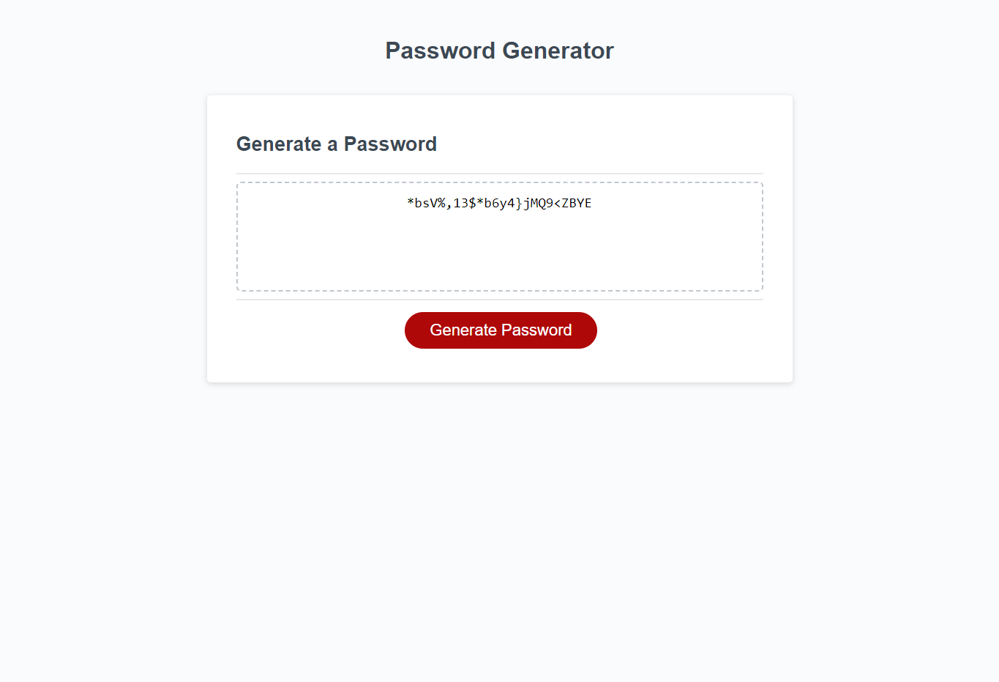

# **Module 3 Challenge:** Password Generator

## Description

The goal of this project was to create a password generator using prompt and confirm functions to set the parameters of the password. Using the responses gained from these functions, more functions were defined and utilized with the JavaScript file in order to randomly generate a password. On the developer side, several global variables were set as arrays in order to access and modify the data more easily. Ideally, this approach with global variables and multiple functions helps to highlight the flow of the process of generating the password and enhances the readability of the code.

## Preview

After the User selects their preferences through the prompt and confirm windows, the webpage should render the password in the provided textbox as shown below:

